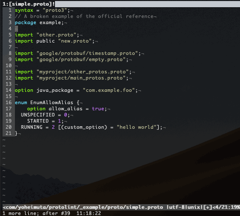

# protolint
[](https://circleci.com/gh/yoheimuta/protolint/tree/master)
[](https://github.com/yoheimuta/protolint/releases)[
](https://goreportcard.com/report/github.com/yoheimuta/protolint)
[](https://github.com/yoheimuta/protolint/blob/master/LICENSE)
[](https://hub.docker.com/r/yoheimuta/protolint)

protolint is the pluggable linting utility for Protocol Buffer files (proto2+proto3):

- Runs fast because this works without compiler.
- Easy to follow the official style guide. The rules and the style guide correspond to each other exactly.
- Allows to disable rules with a comment in a Protocol Buffer file.
  - It is useful for projects which must keep API compatibility while enforce the style guide as much as possible.
- Loads plugins to contain your custom lint rules.
- Undergone testing for all rules.
- Many integration supports.
  - protoc plugin
  - Editor integration
  - GitHub Action
  - CI Integration

## Demo

For example, vim-protolint works like the following.



## Installation

### Via Homebrew

protolint can be installed for Mac or Linux using Homebrew via the [yoheimuta/protolint](https://github.com/yoheimuta/homebrew-protolint) tap.

```
brew tap yoheimuta/protolint
brew install protolint
```

### Via GitHub Releases

You can also download a pre-built binary from this release page:

- https://github.com/yoheimuta/protolint/releases

In the downloads section of each release, you can find pre-built binaries in .tar.gz packages.

### Use the maintained Docker image

protolint ships a Docker image [yoheimuta/protolint](https://hub.docker.com/r/yoheimuta/protolint) that allows you to use protolint as part of your Docker workflow.

```
❯❯❯ docker run --volume "$(pwd):/workspace" --workdir /workspace yoheimuta/protolint lint _example/proto
[_example/proto/invalidFileName.proto:1:1] File name should be lower_snake_case.proto.
[_example/proto/issue_88/oneof_options.proto:11:5] Found an incorrect indentation style "    ". "  " is correct.
[_example/proto/issue_88/oneof_options.proto:12:5] Found an incorrect indentation style "    ". "  " is correct.
```

### From Source

The binary can be installed from source if Go is available.
However, I recommend using one of the pre-built binaries instead because it doesn't include the version info.

```
go get -u -v github.com/yoheimuta/protolint/cmd/protolint
```

## Usage

```
protolint lint example.proto example2.proto # file mode, specify multiple specific files
protolint lint .                            # directory mode, search for all .proto files recursively
protolint .                                 # same as "protolint lint ."
protolint lint -config_path=path/to/your_protolint.yaml . # use path/to/your_protolint.yaml
protolint lint -config_dir_path=path/to .   # search path/to for .protolint.yaml
protolint lint -fix .                       # automatically fix some of the problems reported by some rules
protolint lint -v .                         # with verbose output to investigate the parsing error
protolint lint -no-error-on-unmatched-pattern . # exits with success code even if no file is found (file & directory mode)
protolint lint -reporter junit .            # output results in JUnit XML format
protolint lint -output_file=path/to/out.txt # output results to path/to/out.txt
protolint lint -plugin ./my_custom_rule1 -plugin ./my_custom_rule2 .   # run custom lint rules.
protolint list                              # list all current lint rules being used
protolint version                           # print protolint version
```

protolint does not require configuration by default, for the majority of projects it should work out of the box.

## Editor Integration

Visual Studio Code

- [vscode-protolint](https://github.com/plexsystems/vscode-protolint)

JetBrains IntelliJ IDEA, GoLand, WebStorm, PHPStorm, PyCharm...

- [intellij-protolint](https://github.com/yoheimuta/intellij-protolint)

Vim

- [vim-protolint](https://github.com/yoheimuta/vim-protolint)

## GitHub Action

A [GitHub Action](https://github.com/features/actions) to run protolint in your workflows

- [super-linter](https://github.com/github/super-linter)
- [protolint-action](https://github.com/plexsystems/protolint-action)

## CI Integration

Jenkins Plugins

- [warnings-ng](https://github.com/jenkinsci/warnings-ng-plugin) and any that use [violatons-lib](https://github.com/tomasbjerre/violations-lib)

## Use as a protoc plugin

protolint also maintains a binary [protoc-gen-protolint](cmd/protoc-gen-protolint) that performs the lint functionality as a protoc plugin.

This is useful in situations where you already have a protoc plugin workflow.

## Rules

See `internal/addon/rules` in detail.

The rule set follows:

- [Official Style Guide](https://developers.google.com/protocol-buffers/docs/style). This is enabled by default.
- Unofficial Style Guide. This is disabled by default. You can enable each rule with `.protolint.yaml`.

Some rules support a feature that automatically fixed the problems.

- IMPORTS_SORTED
- INDENT

| Official | ID                                | Purpose                                                                  |
|----------|-----------------------------------|--------------------------------------------------------------------------|
| Yes | ENUM_FIELD_NAMES_UPPER_SNAKE_CASE | Verifies that all enum field names are CAPITALS_WITH_UNDERSCORES.        |
| Yes | ENUM_FIELD_NAMES_ZERO_VALUE_END_WITH | Verifies that the zero value enum should have the suffix (e.g. "UNSPECIFIED", "INVALID"). The default is "UNSPECIFIED". You can configure the specific suffix with `.protolint.yaml`. |
| Yes | ENUM_NAMES_UPPER_CAMEL_CASE       | Verifies that all enum names are CamelCase (with an initial capital).    |
| Yes | FILE_NAMES_LOWER_SNAKE_CASE       | Verifies that all file names are lower_snake_case.proto. You can configure the excluded files with `.protolint.yaml`. |
| Yes | FIELD_NAMES_LOWER_SNAKE_CASE      | Verifies that all field names are underscore_separated_names.            |
| Yes | IMPORTS_SORTED                    | Verifies that all imports are sorted. The --fix option on the command line can automatically fix some of the problems reported by this rule. |
| Yes | MESSAGE_NAMES_UPPER_CAMEL_CASE    | Verifies that all message names are CamelCase (with an initial capital). |
| Yes | ORDER                             | Verifies that all files should be ordered in the specific manner. |
| Yes | PACKAGE_NAME_LOWER_CASE           | Verifies that the package name only contains lowercase letters, digits and/or periods. |
| Yes | RPC_NAMES_UPPER_CAMEL_CASE        | Verifies that all rpc names are CamelCase (with an initial capital).     |
| Yes | SERVICE_NAMES_UPPER_CAMEL_CASE    | Verifies that all service names are CamelCase (with an initial capital). |
| Yes | MAX_LINE_LENGTH    | Enforces a maximum line length. The length of a line is defined as the number of Unicode characters in the line. The default is 80 characters. You can configure the detail with `.protolint.yaml`. |
| Yes | INDENT    | Enforces a consistent indentation style. The --fix option on the command line can automatically fix some of the problems reported by this rule. The default style is 2 spaces. You can configure the detail with `.protolint.yaml`. |
| Yes | PROTO3_FIELDS_AVOID_REQUIRED      | Verifies that all fields should avoid required for proto3.            |
| Yes | PROTO3_GROUPS_AVOID      | Verifies that all groups should be avoided for proto3.            |
| Yes | REPEATED_FIELD_NAMES_PLURALIZED   | Verifies that repeated field names are pluralized names.            |
| No | SERVICE_NAMES_END_WITH    | Enforces a consistent suffix for service names. You can configure the specific suffix with `.protolint.yaml`. |
| No | FIELD_NAMES_EXCLUDE_PREPOSITIONS | Verifies that all field names don't include prepositions (e.g. "for", "during", "at"). You can configure the specific prepositions and excluded keywords with `.protolint.yaml`. |
| No | MESSAGE_NAMES_EXCLUDE_PREPOSITIONS | Verifies that all message names don't include prepositions (e.g. "With", "For"). You can configure the specific prepositions and excluded keywords with `.protolint.yaml`. |
| No | MESSAGES_HAVE_COMMENT | Verifies that all messages have a comment. You can configure to enforce Golang Style comments with `.protolint.yaml`. |
| No | SERVICES_HAVE_COMMENT | Verifies that all services have a comment. You can configure to enforce Golang Style comments with `.protolint.yaml`. |
| No | RPCS_HAVE_COMMENT | Verifies that all rps have a comment. You can configure to enforce Golang Style comments with `.protolint.yaml`. |
| No | FIELDS_HAVE_COMMENT | Verifies that all fields have a comment. You can configure to enforce Golang Style comments with `.protolint.yaml`. |
| No | ENUMS_HAVE_COMMENT | Verifies that all enums have a comment. You can configure to enforce Golang Style comments with `.protolint.yaml`. |
| No | ENUM_FIELDS_HAVE_COMMENT | Verifies that all enum fields have a comment. You can configure to enforce Golang Style comments with `.protolint.yaml`. |
| No | SYNTAX_CONSISTENT | Verifies that syntax is a specified version. The default is proto3. You can configure the version with `.protolint.yaml`. |

I recommend that you add `all_default: true` in `.protolint.yaml`, because all linters above are automatically enabled so that you can always enjoy maximum benefits whenever protolint is updated.

Here are some examples that show good style enabled by default.
`-` is a bad style, `+` is a good style:

__ENUM_FIELD_NAMES_UPPER_SNAKE_CASE__

```diff
enum Foo {
-  firstValue = 0;
+  FIRST_VALUE = 0;
-  second_value = 1;
+  SECOND_VALUE = 1;
}
```

__ENUM_FIELD_NAMES_ZERO_VALUE_END_WITH__

```diff
enum Foo {
-  FOO_FIRST = 0;
+  FOO_UNSPECIFIED = 0;
}
```

__ENUM_NAMES_UPPER_CAMEL_CASE__

```diff
- enum foobar {
+ enum FooBar {
  FIRST_VALUE = 0;
  SECOND_VALUE = 1;
}
```

__FIELD_NAMES_LOWER_SNAKE_CASE__

```diff
message SongServerRequest {
-  required string SongName = 1;
+  required string song_name = 1;
}
```

__IMPORTS_SORTED__

```diff
- import public "new.proto";
+ import "myproject/other_protos.proto";
- import "myproject/other_protos.proto";
+ import public "new.proto";

import "google/protobuf/empty.proto";
import "google/protobuf/timestamp.proto";
```

__MESSAGE_NAMES_UPPER_CAMEL_CASE__

```diff
- message song_server_request {
+ message SongServerRequest {
  required string SongName = 1;
  required string song_name = 1;
}
```

__ORDER__

```diff
- option java_package = "com.example.foo";
- syntax = "proto3";
- package examplePb;
- message song_server_request { }
- import "other.proto";
+ syntax = "proto3";
+ package examplePb;
+ import "other.proto";
+ option java_package = "com.example.foo";
+ message song_server_request { }
```

__PACKAGE_NAME_LOWER_CASE__

```diff
- package myPackage
+ package my.package
```

__RPC_NAMES_UPPER_CAMEL_CASE__

```diff
service FooService {
-  rpc get_something(FooRequest) returns (FooResponse);
+  rpc GetSomething(FooRequest) returns (FooResponse);
}
```

__RPC_NAMES_UPPER_CAMEL_CASE__

```diff
- service foo_service {
+ service FooService {
  rpc get_something(FooRequest) returns (FooResponse);
  rpc GetSomething(FooRequest) returns (FooResponse);
}
```

__REPEATED_FIELD_NAMES_PLURALIZED__

```diff
-  repeated string song_name = 1;
+  repeated string song_names = 1;
```

## Creating your custom rules

protolint is the pluggable linter so that you can freely create custom lint rules.

A complete sample project (aka plugin) is included in this repo under the [_example/plugin](_example/plugin) directory.

## Reporters

protolint comes with several built-in reporters(aka. formatters) to control the appearance of the linting results.

You can specify a reporter using the -reporter flag on the command line. For example, `-reporter junit` uses the junit reporter.

The built-in reporter options are:

- plain (default)
- junit
- json
- unix

## Configuring

__Disable rules in a Protocol Buffer file__

Rules can be disabled with a comment inside a Protocol Buffer file with the following format.
The rules will be disabled until the end of the file or until the linter sees a matching enable comment:

```
// protolint:disable <ruleID1> [<ruleID2> <ruleID3>...]
...
// protolint:enable <ruleID1> [<ruleID2> <ruleID3>...]
```

It's also possible to modify a disable command by appending :next or :this for only applying the command to this(current) or the next line respectively.

For example:

```proto
enum Foo {
  // protolint:disable:next ENUM_FIELD_NAMES_UPPER_SNAKE_CASE
  firstValue = 0;    // no error
  second_value = 1;  // protolint:disable:this ENUM_FIELD_NAMES_UPPER_SNAKE_CASE
  THIRD_VALUE = 2;   // spits out an error
}
```

__Config file__

protolint can operate using a config file named `.protolint.yaml`.

Refer to [_example/config/.protolint.yaml](_example/config/.protolint.yaml) for the config file specification.

protolint will search a current working directory for the config file by default.
And it can search the specified directory with `-config_dir_path` flag.
It can also search the specified file with `--config_path` flag.

## Exit codes

When linting files, protolint will exit with one of the following exit codes:

- `0`: Linting was successful and there are no linting errors.
- `1`: Linting was successful and there is at least one linting error.
- `2`: Linting was unsuccessful due to all other errors, such as parsing, internal, and runtime errors.

## Motivation

There exists the similar protobuf linters as of 2018/12/20.

One is a plug-in for Google's Protocol Buffers compiler.

- When you just want to lint the files, it may be tedious to create the compilation environment.
- And it generally takes a lot of time to compile the files than to parse the files.

Other is a command line tool which also lints Protocol Buffer files.

- While it has a lot of features other than lint, it seems cumbersome for users who just want the linter.
- The lint rule slants towards to be opinionated.
- Further more, the rule set and the official style guide don't correspond to each other exactly. It requires to understand both rules and the guide in detail, and then to combine the rules accurately.

### Other tools

I wrote an article comparing various Protocol Buffer Linters, including protolint, on 2019/12/17.

- https://qiita.com/yoheimuta/items/da7678fcd046b93a2637
  - NOTE: This one is written in Japanese.

## Dependencies

- [go-protoparser](https://github.com/yoheimuta/go-protoparser)

## Contributing

- Fork it
- Create your feature branch: git checkout -b your-new-feature
- Commit changes: git commit -m 'Add your feature'
- Pass all tests
- Push to the branch: git push origin your-new-feature
- Submit a pull request

## License

The MIT License (MIT)

## Acknowledgement

Thank you to the prototool package: https://github.com/uber/prototool

I referred to the package for the good proven design, interface and some source code.
